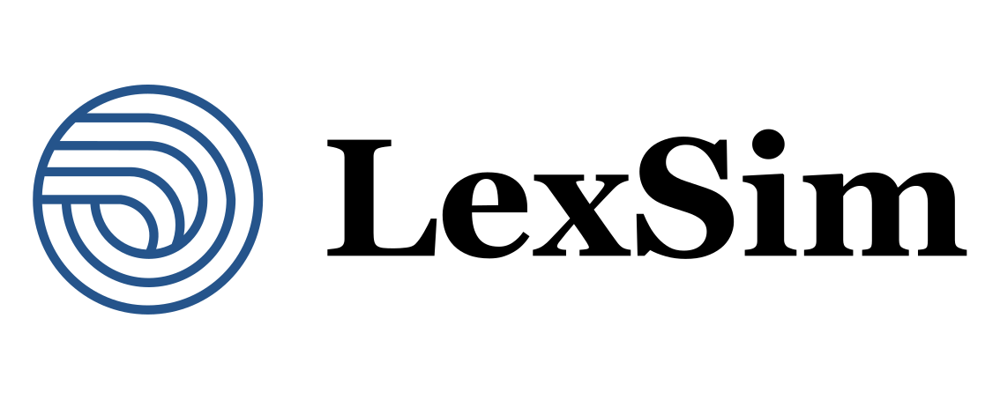
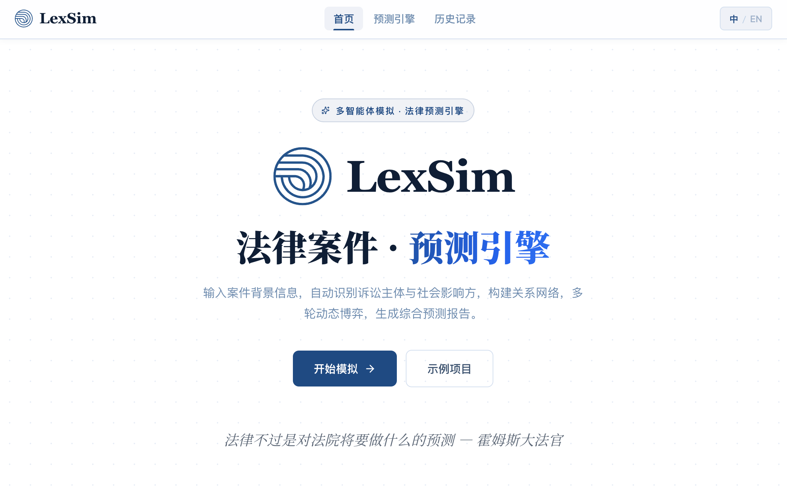
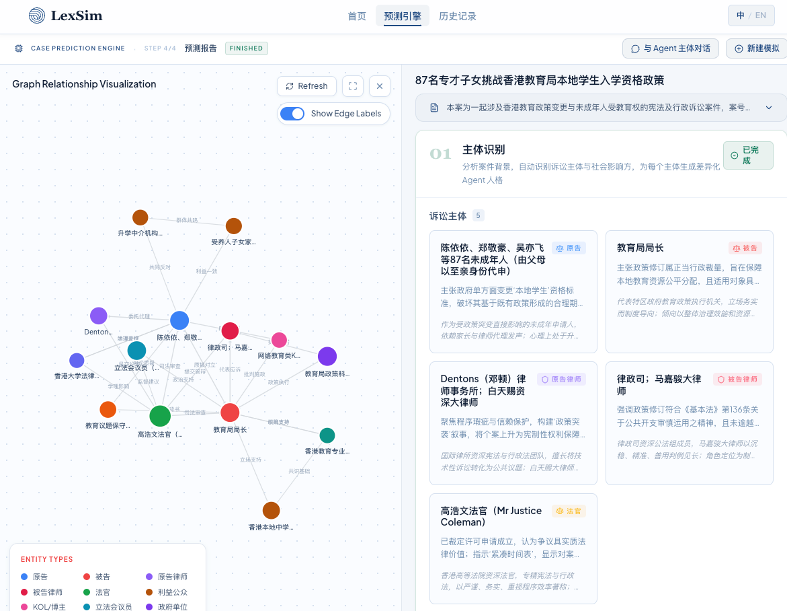
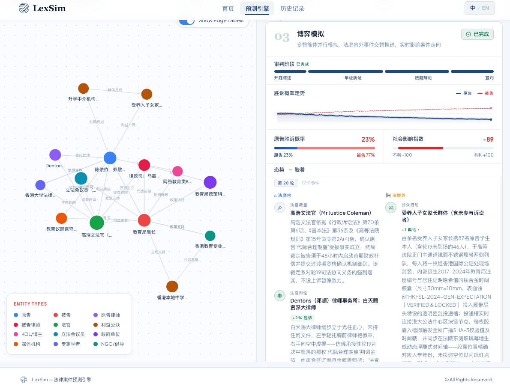
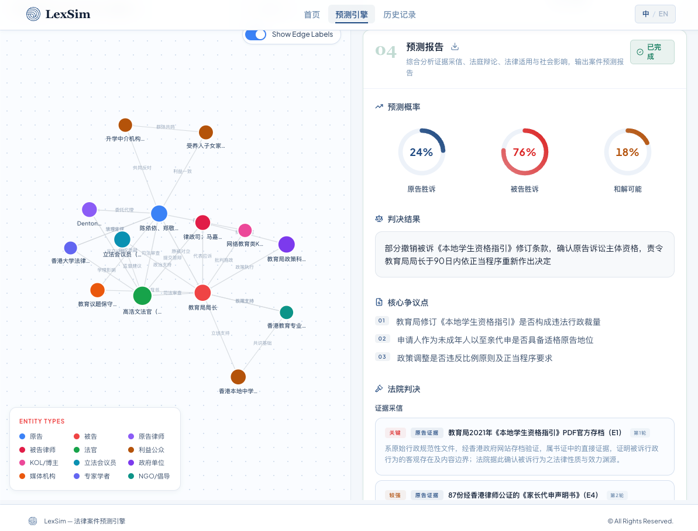
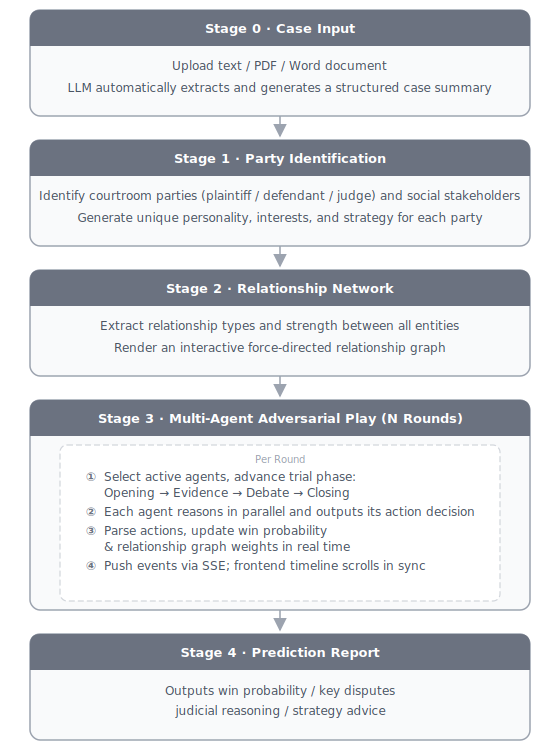

# **LexSim — Legal Case Prediction Engine**

<div align="center">

</div>

<p align="center"><em>The prophecies of what the courts will do in fact, and nothing more pretentious, are what I mean by the law.</em></p>
<p align="center"><em>— Justice Oliver Wendell Holmes</em></p>

<p align="center">
  <a href="./README.md">中文</a> | <a href="./README-EN.md">English</a>
</p>

**LexSim** is a multi-agent simulation and prediction tool for legal cases. Unlike traditional "Q&A-style" legal AI, it instantiates the parties in a case — plaintiffs, defendants, judges, and broader social stakeholders (government agencies, legislators, media outlets, bloggers, etc.) — as individual LLM Agents, each with their own personality, stance, and behavioral strategy, making autonomous decisions across multiple rounds of adversarial play. Based on the dynamic interplay between these agents, the system computes real-time win probability for both sides, tracks social influence outside the courtroom, and generates a comprehensive prediction report covering case trajectory, likely verdict, judicial reasoning, litigation strategy, and societal impact assessment.

<p align="center"><em>Input case background → Identify parties → Build relationship network → Multi-agent adversarial simulation → Generate comprehensive prediction report</em></p>

---

## Key Features

Inspired by [MiroFish](https://github.com/666ghj/MiroFish), LexSim has been deeply re-engineered for legal scenarios with a stronger focus on workflow rigor and depth of reasoning.

The theoretical foundation draws from **Legal Realism** and the sociological concept of the **Embedded Court** — the idea that judicial decisions are never made in isolation, but are deeply embedded in social relationships, public opinion, and political dynamics.

- **Beyond the courtroom — a full social arena**: In addition to the plaintiff, defendant, and judge, LexSim automatically identifies and introduces relevant social stakeholders: government agencies, legislators, media outlets, online commentators, and more. They speak out, apply pressure, and maneuver outside the courtroom, collectively shaping the case — just as they do in reality.
- **Every party has its own voice and character**: Each participant is given an independent personality, set of interests, and action strategy. They don't follow a fixed script — they read the situation and act accordingly, just like real people would.
- **A relationship network you can see**: Every connection between parties — support, opposition, pressure, cooperation — is rendered as an interactive visual graph. Spot the key players and see how power is distributed at a glance.
- **Authentic courtroom pacing**: The simulation progresses through four stages — Opening Statements → Evidence Exchange → Cross-Examination → Closing Arguments — with different actions available at each phase, faithfully recreating the rhythm of a real trial.
- **Control the depth of simulation**: Set anywhere from 10 to 50 rounds of play (default: 20) to simulate everything from a straightforward dispute to a drawn-out high-stakes case.
- **Deep analysis, not just a score**: The prediction report goes far beyond a single win-probability number. The system systematically breaks down key evidence, identifies turning points, evaluates public sentiment trends and potential risks, and delivers a well-grounded overall judgment alongside actionable litigation strategy advice.
- **Watch the simulation unfold in real time**: As the simulation runs, each agent's moves, arguments, and decisions scroll by like a live feed — so you can follow exactly how the situation evolves, step by step.

---

## Quick Start

### ⚡️ **[Online Demo](https://lawmotionai.com/)**

### 💻 **Local Deployment**

### Step 1: Install Node.js (skip if already installed)

Open a terminal (search "Terminal" on Mac, "PowerShell" on Windows) and run the command for your system:

**macOS / Linux**
```bash
# Install nvm (Node Version Manager)
curl -o- https://raw.githubusercontent.com/nvm-sh/nvm/v0.39.7/install.sh | bash

# Reload your shell config to activate nvm
source ~/.bashrc 2>/dev/null || source ~/.zshrc 2>/dev/null

# Install the LTS version of Node.js
nvm install --lts
```

**Windows** (run in PowerShell)
```powershell
# Install Node.js LTS via winget (built into Windows 10/11)
winget install OpenJS.NodeJS.LTS
```

Verify the installation:

```bash
node -v   # Should display v20.x.x or higher
```

### Step 2: Download and install the project

Run the following commands in your terminal:

```bash
# Clone the repository
git clone https://github.com/zhouziyue233/LexSim.git
cd LexSim

# Install dependencies (takes about 1 minute; "found 0 vulnerabilities" means success)
npm install
npm --prefix server install
```

### Step 3: Start

```bash
npm run dev
```

You should see the following output, confirming a successful start:

```
[client] ➜  Local:   http://localhost:5173/
[server] Server running on port 3001
```

Open **http://localhost:5173** in your browser to get started.

> **Configure your AI model**: Before running your first simulation, click **"Model Settings"** in the top-right corner of the prediction engine page and enter your API Key. Supported providers include Alibaba Qwen, OpenAI, DeepSeek, Kimi, GLM, Claude, Gemini, and more.

### 👍 Try the Demo

First time here? Click `Demo Project` on the home page to jump straight to a sample case and experience the full output of the prediction engine.

**Screenshots:**

<div align="center">








</div>

---

## Simulation Flow

<div align="center">

</div>

---

*Disclaimer: LexSim is a research simulation tool. Its outputs do not constitute legal advice. LLM reasoning involves inherent uncertainty — please consult a qualified attorney for real legal matters.*

---

## Communication

💌  719957352@qq.com


## 📈 Star History

 <picture>
   <source media="(prefers-color-scheme: dark)" srcset="https://api.star-history.com/svg?repos=zhouziyue233/LexSim&type=date&theme=dark&legend=top-left" />
   <source media="(prefers-color-scheme: light)" srcset="https://api.star-history.com/svg?repos=zhouziyue233/LexSim&type=date&legend=top-left" />
   
 </picture>
